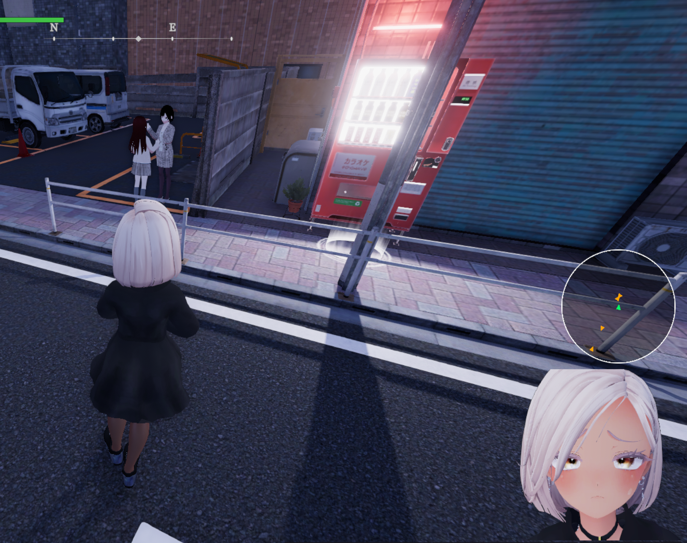

# NPC Compass

[English](README.md) | **中文**

在游戏画面上叠加一个圆形罗盘，实时显示当前场景内 NPC 的位置和朝向。



## 功能

- 屏幕右侧中央显示一个圆形罗盘
- 罗盘以**相机水平朝向**为顶部（你看到的前方 = 罗盘上方）
- 玩家和周围 NPC 用三角形渲染，同时显示位置和朝向
- NPC 颜色反映当前怀疑度（strangeness）— 平静时白色，高度警觉时深红色
- 自动过滤：距离过远、不在同一楼层的 NPC 不绘制

### 罗盘元素

| 元素 | 颜色 | 含义 |
|---|---|---|
| 玩家 | 亮绿色三角形 | 永远在罗盘中心，顶点指向玩家身体朝向 |
| 普通 NPC | 白 → 红 渐变三角形 | 除按门铃外的所有 NPC（街上走动、坐着、车内、便利店店员等）。颜色反映当前 strangeness：白=0（平静），深红=1（高度警觉） |
| Pinpon NPC | 浅灰色三角形 | 按门铃叫出来的屋内 NPC |

三角形的顶点始终指向该 NPC 当前的面向方向。

## 用法

按 **F8** 切换罗盘的显示和隐藏。

剩下的就是观察，罗盘每帧自动更新。

## 安装

### 前置：BepInEx 6 (IL2CPP)

本插件依赖 **BepInEx 6.0.0-be.735** 或兼容的 6.x bleeding-edge 构建（IL2CPP, x64）。

经过测试的版本是 `BepInEx 6.0.0-be.735`（commit `5fef3570`）。其他 6.x bleeding-edge 构建大概率也能工作，前提是 IL2CPP 互操作 API 没有大的变化。

如果游戏目录下已经有 `BepInEx/` 文件夹并且其他 BepInEx 插件能正常工作，跳过此步。否则：

1. 去 [BepInEx bleeding-edge 构建页](https://builds.bepinex.dev/projects/bepinex_be) 下载 `BepInEx-Unity.IL2CPP-win-x64-6.0.0-be.XXX+...zip`
2. 解压到游戏根目录（包含 `SecretFlasherManaka.exe` 的那个文件夹）
3. 启动游戏一次让 BepInEx 生成完整的 `BepInEx/` 目录结构，然后退出

### 安装本插件

1. 打开游戏根目录，进入 `BepInEx/plugins/` 子目录（如果不存在就新建）
2. 把 `NpcCompass.dll` 直接放进去

   也可以放在 `BepInEx/plugins/NpcCompass/NpcCompass.dll` 这样的子文件夹里，BepInEx 会递归扫描，两种布局都可以。

3. 启动游戏，进入有 NPC 的场景。按 F8 应该看到罗盘出现在屏幕右侧中央。
4. 首次启动后会在 `BepInEx/config/com.local.npccompass.cfg` 自动生成配置文件。

### 验证安装成功

打开 `BepInEx/LogOutput.log`（或观察 BepInEx 控制台），应该看到：

```
[Info: NPC Compass] NPC Compass 0.5.0 loaded.
```

如果没有这行，说明插件没被加载——通常是 BepInEx 版本不对（必须是 **IL2CPP** 6.x）或 dll 放错位置。

### 卸载

删除 `NpcCompass.dll`。配置文件 `BepInEx/config/com.local.npccompass.cfg` 可选删除。

## 配置

首次启动后会生成配置文件，所有选项：

| 配置项 | 默认值 | 说明 |
|---|---|---|
| `[General] Enabled` | `true` | 游戏启动时是否默认显示罗盘 |
| `[Input] ToggleKey` | `F8` | 切换罗盘的按键 |
| `[Display] Anchor` | `MiddleRight` | 罗盘位置，可选：`MiddleRight` / `MiddleLeft` / `TopRight` / `TopLeft` / `BottomRight` / `BottomLeft` / `TopCenter` |
| `[Display] MarginX` | `20` | 距锚点的水平像素偏移 |
| `[Display] MarginY` | `20` | 距锚点的垂直像素偏移 |
| `[Display] Radius` | `100` | 罗盘半径（像素）。**改这一项需要重启游戏才生效** |
| `[Display] MaxRange` | `30` | 多少世界单位（≈ 米）外的 NPC 不绘制 |
| `[Display] MaxHeightDiff` | `3` | 玩家与 NPC 的 Y 高度差超过这个值就不绘制，用来过滤楼上楼下的 NPC |

修改保存后下次进入游戏生效（`Radius` 例外，必须重启）。

## 兼容性

- **游戏**：Secret Flasher Manaka v1.1.3
- **BepInEx**：6.0.0-be.735（已测试）— 大概率兼容任意 bleeding-edge 6.x IL2CPP 构建
- **Unity**：2022.3.62f2（游戏运行时）

理论上游戏更新只要 `NpcManager.ExistNpcList` 和 `NpcController` 的接口没变就能继续使用。

## 故障排查

**罗盘不显示**

- 确认场景里有 NPC（主菜单 / loading / 过场时不显示）
- 按 F8 试试（可能上次退出时设置成关闭状态）
- 查 `BepInEx/LogOutput.log` 找 `NPC Compass` 相关日志。如果没有 `loaded` 行，说明插件没被加载，通常是 BepInEx 版本不对

**罗盘位置不合适**

- 改配置文件里的 `Anchor` / `MarginX` / `MarginY`

**罗盘上 NPC 太多很乱**

- 调小 `MaxRange`（默认 30，可改 15–20）
- 调小 `MaxHeightDiff`（默认 3，复杂地形可改 2）

**想看到更多调试信息**

- 编辑 `BepInEx/config/BepInEx.cfg`，找到 `[Logging.Console]` 部分的 `LogLevels`，在末尾加上 `Debug`
- 重启游戏，会多出 F8 切换反馈和每 5 秒一次的 NPC 统计

## 隐私

- 完全本地运行，不联网
- 不读写存档
- 不收集任何用户数据

## 已知限制

- 改 `Radius` 必须重启游戏（纹理在启动时生成）
- `MaxHeightDiff` 是硬阈值，复杂多层地形（带斜坡、夹层）可能误过滤
- 不显示 NPC 名字 / 状态详情，只显示位置和朝向
